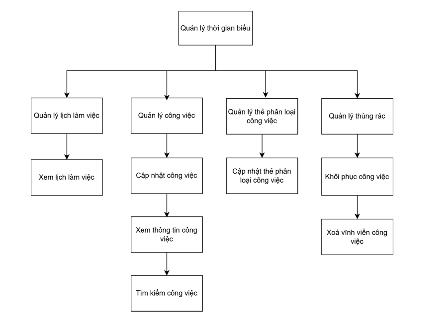
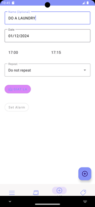
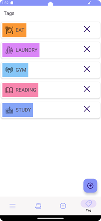
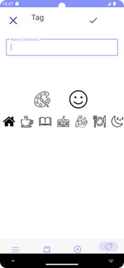
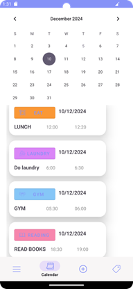
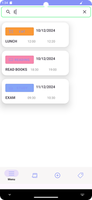
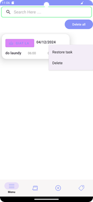

### BÀI TẬP LỚN ANDROID STUDIO KÌ 2 NĂM 3 ỨNG DỤNG BAO GỒM VIỆC ĐẶT LỊCH CHO CÁC HOẠT ĐỘNG TRONG NGÀY

## LOGO TODOTASK

## BFD_SoDoPhanRaChucNang

# Đặc tả các chức năng

## Quản lý nhiệm vụ (Task Management)

### a. Thêm nhiệm vụ mới (Add Task):
- Người dùng có thể thêm tên công việc, ngày, giờ bắt đầu/kết thúc, tần suất lặp lại, và gắn thẻ (Tag).
- Hỗ trợ lưu công việc có thông tin đầy đủ vào cơ sở dữ liệu.

### b. Hiển thị danh sách nhiệm vụ (Task List):
- Danh sách công việc được hiển thị theo ngày tháng cụ thể, tự động cập nhật khi người dùng chọn ngày trên CalendarView.
- Công việc có thể được tìm kiếm theo từ khóa trong tên nhiệm vụ.

### c. Chỉnh sửa công việc (Edit Task):
- Người dùng có thể chỉnh sửa công việc đã tạo, bao gồm các thông tin chi tiết như thời gian, tên nhiệm vụ, và Tag.
- Dữ liệu được cập nhật trong cơ sở dữ liệu khi chỉnh sửa hoàn tất.

### d. Xóa và phục hồi công việc (Delete and Restore Tasks):
- Công việc có thể được xóa thông qua thao tác vuốt ngang trên RecyclerView.
- Công việc bị xóa sẽ được đưa vào Thùng rác (Bin) và có thể phục hồi hoặc xóa vĩnh viễn tại đây.

## Quản lý thẻ (Tag Management)

<table>
  <tr>
    <td> 
TagList
</td>
    <td> 
AddTag
</td>
  </tr>
</table>

### a. Thêm thẻ mới (Add Tag):
- Người dùng có thể tạo thẻ với tên, biểu tượng, và màu sắc tùy chỉnh.
- Thẻ được sử dụng để phân loại hoặc gắn nhãn nhiệm vụ.

### b. Hiển thị danh sách thẻ (Tag List):
- Danh sách các thẻ hiển thị trên giao diện TagFragment với đầy đủ thông tin (tên, biểu tượng, màu sắc).

### c. Chỉnh sửa thẻ (Edit Tag):
- Hỗ trợ chỉnh sửa tên, biểu tượng, và màu sắc của thẻ.
- Dữ liệu thẻ được cập nhật trong cơ sở dữ liệu và hiển thị lại danh sách.

### d. Xóa thẻ (Delete Tag):
- Người dùng có thể xóa thẻ. Các công việc liên quan đến thẻ đó sẽ bị cập nhật trạng thái.

## Chức năng lịch (Calendar Integration)

### a. Chọn ngày hiển thị nhiệm vụ (Task Filtering by Date):
- Sử dụng CalendarView, người dùng có thể chọn ngày để xem danh sách công việc tương ứng.
- Ứng dụng tự động lọc công việc trong cơ sở dữ liệu dựa trên ngày được chọn.

### b. Tự động hiển thị nhiệm vụ hôm nay (Today's Task Auto-load):
- Khi mở ứng dụng, danh sách công việc của ngày hiện tại sẽ tự động hiển thị.

## Tìm kiếm và lọc (Search and Filter)

### a. Tìm kiếm nhiệm vụ (Task Search):
- Hỗ trợ tìm kiếm công việc trong Thùng rác (Bin) bằng cách nhập từ khóa tên công việc.
- Danh sách công việc được lọc ngay lập tức dựa trên từ khóa.
### b. Tìm kiếm nâng cao theo thẻ (Advanced Filtering by Tag):
- Công việc có thể được hiển thị theo từng thẻ cụ thể để hỗ trợ quản lý tốt hơn.
## Xử lý dữ liệu trong Thùng rác (Bin Management)

### a. Khôi phục nhiệm vụ (Restore Tasks):
- Công việc trong thùng rác có thể được khôi phục về danh sách nhiệm vụ chính.

### b. Xóa vĩnh viễn công việc (Permanent Deletion):
- Người dùng có thể xóa vĩnh viễn từng công việc hoặc toàn bộ công việc trong thùng rác.

